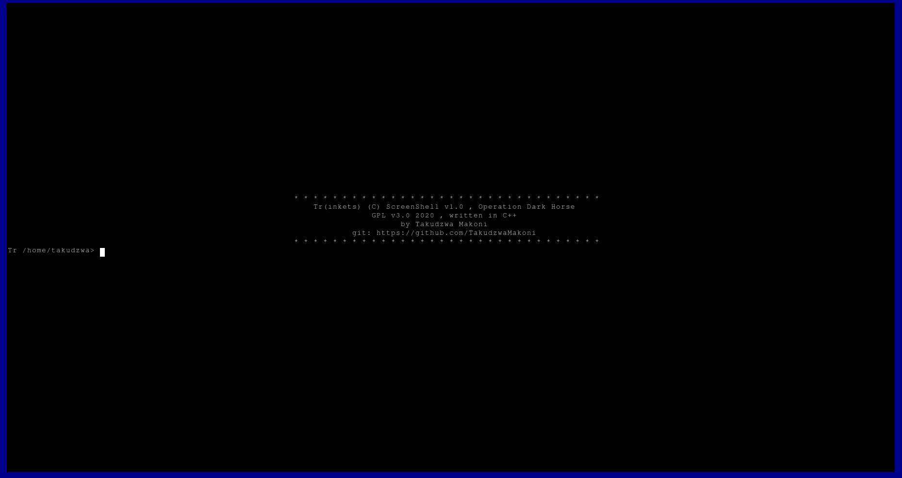
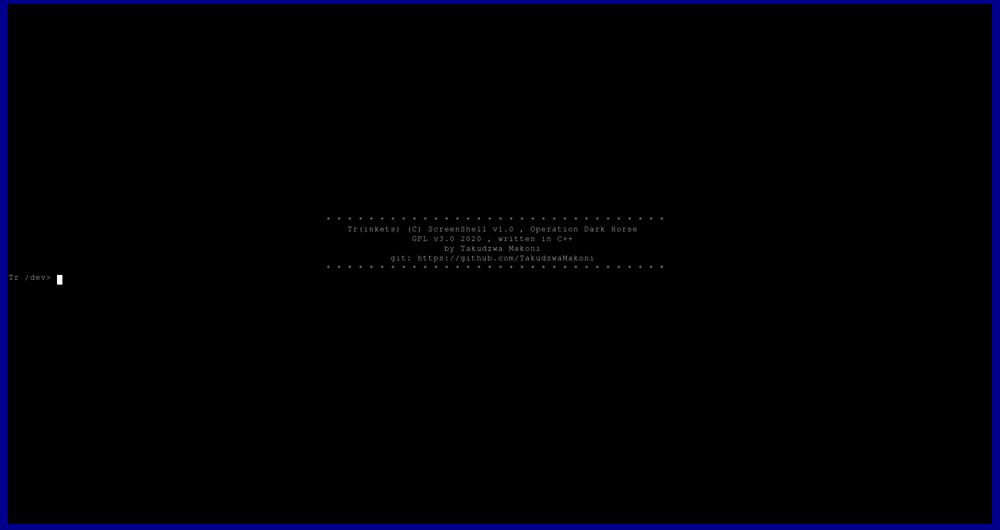
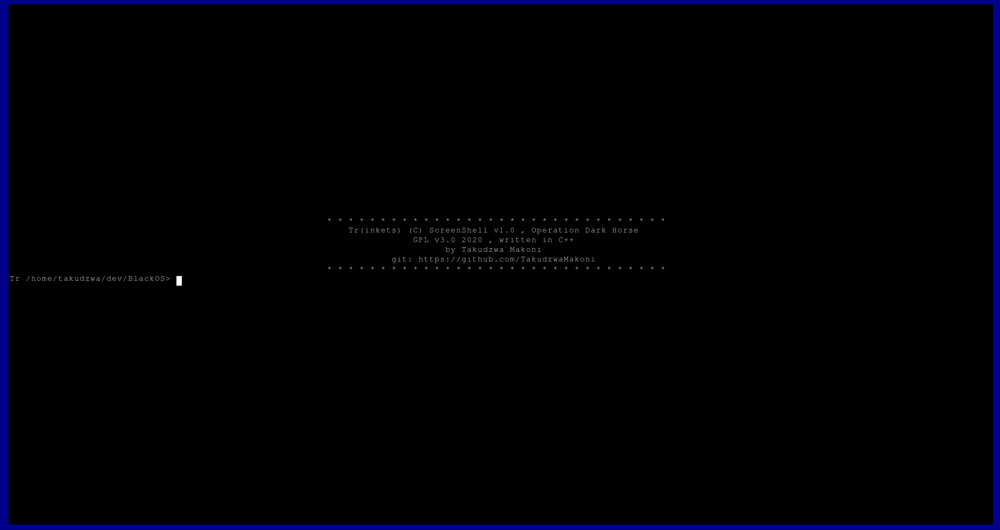
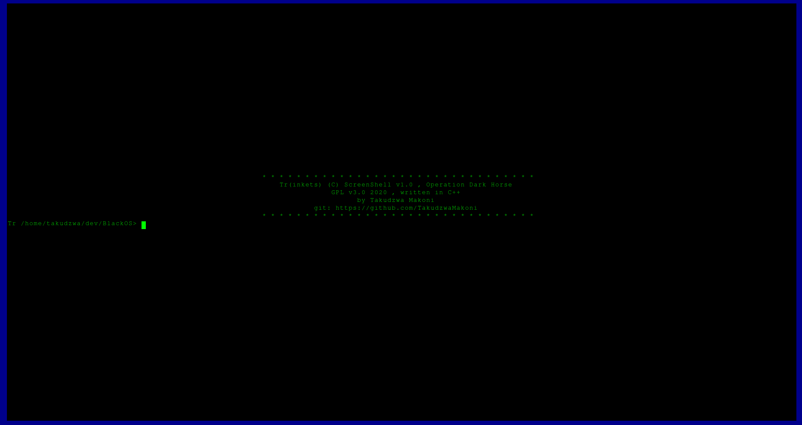

BlackOS is currently comprised of the Trinkets shell and the DisplayKernel library detailed below, but there are other ideas that i want to entertain (so if you would like to collaborate, let me know please). That aside, there are many features and fixes to be added to both (so if you would like to collaborate: please, let me know).

Every once in a while i get an idea i want to try in some language. I had started calling them silly things like "Operation Dark Horse", which is really just the name handle for "cool stuff you can do in the terminal with C++". Operation Dark Horse is the successor to Operation FreedomFighter (OFF), the name handle for "cool stuff you can do with python". Originally i would just call projects freedomfighter and dark horse, though i started prepending "operation" to them, it will surely motivate me to actually try the ideas i come up with instead of never getting around to it (Now i use the code to distract myself from other important things), as well as it being my continued contribution to the ongoing commitment to lighten up. 

# ScreenShell

Trinkets ScreenShell (C) is a fullscreen shell which uses the DisplayKernel API to develop a powerful shellsurfing UI and a feature rich Terminal Shell superposed onto the default shell. It is based on an earler project which was essentially a few bash and python shortcuts and tools while using the terminal.

## starting the shell
After building from source, you can start the Trinkets Screenshell by running the binary Tr in Framework/Trinkets/ScreenShell.
Instead of moving this binary to bin in the PATH folder, i have made an alias for the binary in the build directory in the shell config file (e.g. for bash it is ~/.bashrc).

## list children in parent directory
The built in commands are named after their corresponding unix-like equivalent, including also optional flags. The ls command includes the option -a to show hidden files. It displays an ordered list of files in the given directory (the current directory as default if no directory parameter is entered), with information about each file.

## navigate the filesystem with 'nd' 
the built in command nd opens a UI window so that the user can navigate the filesystem, starting either at the current or some given directory, with option -a to show hidden files. When activated, the user can view directory contents, jump in and out of files using an editor, and change to a selected directory.

### editing files with 'nd' 

### switch on 'show hidden items' option 

### large number of files are automatically paginated

## shortcut to directories
sc is a built in command that opens a window containing a list of shortcuts and their paths, so that the user can quickly jump to that directory. Shortcuts can be added or removed by editing the file in home/user/.tr/shortcuts.txt

## customise and configure the shell
The shell can be customised by editing the file /home/user/.tr/config.txt. The user can map keys to actions, can change the theme and appearance of the shell. These configurations will be loaded on startup of the shell.

### changing themes 

The DisplayKernel (C) API features Methods for creating c++ programs with a terminal-based User Interface.

